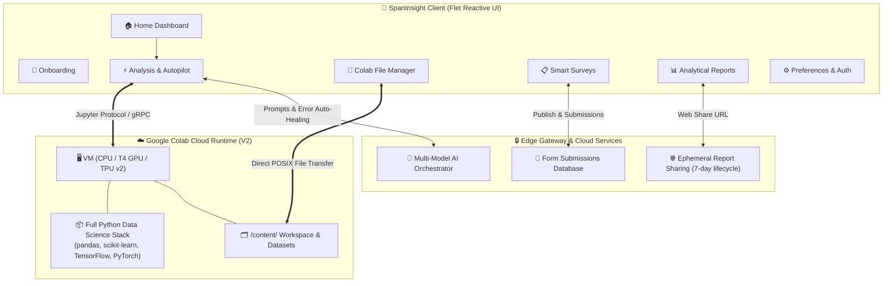

<p align="center">
  
</p>

<p align="center">
  A high-performance, cloud-powered data intelligence platform for smart data collection, Colab GPU/TPU analysis, and autonomous reporting.
</p>

<p align="center">
  
  
  
  
</p>

---

## Architecture Flow


```mermaid
flowchart TD
    subgraph APP ["📱 SpanInsight Client (Flet Reactive UI)"]
        Onboard["🚀 Onboarding"]
        Home["🏠 Home Dashboard"]
        Analysis["⚡ Analysis & Autopilot"]
        Files["📁 Colab File Manager"]
        Forms["📋 Smart Surveys"]
        Reports["📊 Analytical Reports"]
        Settings["⚙️ Preferences & Auth"]
    end

    subgraph COLAB ["☁️ Google Colab Cloud Runtime (V2)"]
        VM["🖥️ VM (CPU / T4 GPU / TPU v2)"]
        Env["📦 Full Python Data Science Stack\n(pandas, scikit-learn, TensorFlow, PyTorch)"]
        POSIX["🗂️ /content/ Workspace & Datasets"]
        VM --- Env
        VM --- POSIX
    end

    subgraph GATEWAY ["🔒 Edge Gateway & Cloud Services"]
        AI["🤖 Multi-Model AI Orchestrator"]
        D1["💾 Form Submissions Database"]
        R2["🌐 Ephemeral Report Sharing (7-day lifecycle)"]
    end

    Analysis <==>|Jupyter Protocol / gRPC| VM
    Files <==>|Direct POSIX File Transfer| POSIX
    Analysis <-->|Prompts & Error Auto-Healing| AI
    Forms <-->|Publish & Submissions| D1
    Reports <-->|Web Share URL| R2
    Home --> Analysis
```

---

## Core Capabilities (Version 2)

| Capability | Description |
|:---|:---|
| **Colab Cloud Runtime** | Heavy compute runs on Google Colab VMs. No local memory/CPU bottlenecks — scale to millions of rows with free GPU/TPU acceleration. |
| **Autonomous Autopilot** | Multi-pass self-directed analytical engine that formulates hypotheses, executes code, generates plots, and compiles full analytical reports. |
| **Self-Healing Code Execution** | Real-time Python traceback inspection — if code errors, AI automatically heals the code and retries execution. |
| **Interactive File Explorer** | Complete cloud file manager with breadcrumb navigation, folder zip downloads, upload pipelines, and 1-tap "Load in Analysis". |
| **Smart Surveys** | Natural language survey generation (Voice / Text) with instant mobile preview, cloud responses tracking, and CSV export. |
| **Rich Report Editor** | Reorderable narrative blocks, interactive metrics, chart visualizers, and AI executive summary polishing with live public web sharing. |
| **Jupyter (.ipynb) Export** | Export your active analysis sessions directly to standard Jupyter Notebook (`.ipynb`) files. |

---

## Screen Directory Structure

The codebase is organized into modular packages under `src/screens/`:

- [`src/screens/home/`](src/screens/home/) — Landing dashboard, Colab cloud connection banner, credit status, and quick starts.
- [`src/screens/analysis/`](src/screens/analysis/) — Interactive notebook editor, streaming terminal outputs, voice prompts, and Autopilot engine.
- [`src/screens/files/`](src/screens/files/) — Colab POSIX filesystem explorer, file/folder download fallbacks, and quick dataset loader.
- [`src/screens/forms/`](src/screens/forms/) — AI survey questionnaire creator, cloud publication, and live submissions viewer.
- [`src/screens/reports/`](src/screens/reports/) — Report compiler, block visualizers, AI arranger, and ephemeral web share generator.
- [`src/screens/settings/`](src/screens/settings/) — Google OAuth2 authentication, GPU/TPU hardware preferences, and diagnostics log terminal.

---

## Testing & Quality Assurance

SpanInsight V2 features a 100% passing test suite across all services, core modules, and screen workflows:

```bash
# Run unit and integration tests
uv run pytest

# Check formatting and linting
uv run ruff check
uv run ruff format
```

---

## Credit System

| Action | Credits |
|:---|:---|
| AI Suggestion | 1 |
| Custom Prompt / Voice | 3 |
| Autopilot (Full Multi-Step Report) | 15 |
| **Daily Allowance** | **50 FREE** (resets midnight UTC) |
| Manual Python Code Mode | **FREE** (unlimited) |
