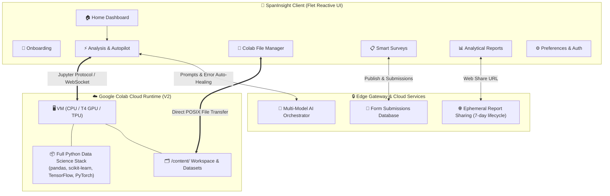

<p align="center">
  
</p>

<p align="center">
  A high-performance, cloud-powered data intelligence platform for smart data collection, Colab GPU/TPU analysis, and autonomous reporting.
</p>

<p align="center">
  <a href="https://play.google.com/store/apps/details?id=com.spaninsight.app"></a>
  <a href="https://github.com/Nwokike/spaninsight/releases/latest"></a>
  <a href="https://github.com/Nwokike/spaninsight/releases/latest"></a>
  <a href="https://github.com/Nwokike/spaninsight/releases/latest"></a>
  
  
  
</p>

---

## Download

| Platform | Download | Notes |
| :---: | :---: | :--- |
| 🤖 **Android (Google Play)** | [](https://play.google.com/store/apps/details?id=com.spaninsight.app) | Recommended for Android phone and tablet users |
| 🪟 **Windows** | [](https://github.com/Nwokike/spaninsight/releases/latest/download/SpanInsight_Setup.exe) | Automated standalone setup installer with desktop shortcut integration |
| 🐧 **Linux (Debian/Ubuntu)** | [](https://github.com/Nwokike/spaninsight/releases/latest/download/SpanInsight_amd64.deb) | Desktop package tailored for Ubuntu, Debian, Linux Mint & Pop!_OS |
| 🎩 **Linux (Fedora/RHEL)** | [](https://github.com/Nwokike/spaninsight/releases/latest/download/SpanInsight_x86_64.rpm) | Desktop package tailored for Fedora, openSUSE, RHEL & CentOS |
| 📦 **Linux (Universal Portable)** | [](https://github.com/Nwokike/spaninsight/releases/latest/download/SpanInsight_linux_x86_64.tar.gz) | Universal standalone portable archive for Arch, Alpine, Steam Deck & all distros |

### Android Architecture Build Splits (Direct APK)

| Variant | Download | Notes |
| :--- | :---: | :--- |
| 📱 **ARM64** (most phones) | [**spaninsight-arm64-v8a.apk**](https://github.com/Nwokike/spaninsight/releases/latest/download/spaninsight-arm64-v8a.apk) | Modern 64-bit Android devices |
| 📱 **ARMv7** (older phones) | [**spaninsight-armeabi-v7a.apk**](https://github.com/Nwokike/spaninsight/releases/latest/download/spaninsight-armeabi-v7a.apk) | Legacy 32-bit Android devices |
| 💻 **x86_64** (emulators) | [**spaninsight-x86_64.apk**](https://github.com/Nwokike/spaninsight/releases/latest/download/spaninsight-x86_64.apk) | Chromebooks & Android emulators |

---

## Core Capabilities

| Capability | Description |
| :--- | :--- |
| **Google Colab Cloud Execution** | Heavy computations, machine learning models, and complex datasets execute on Google Colab GPUs and TPUs with zero battery drain on your phone. |
| **Autonomous Autopilot** | Multi-pass self-directed analytical engine that formulates hypotheses, executes code, generates plots, and compiles full analytical reports with expandable thought accordions. |
| **Self-Healing Code Execution** | Real-time Python traceback inspection: if code encounters an error during execution, AI automatically analyzes the traceback, repairs the code, and retries seamlessly. |
| **Jupyter (.ipynb) Session Export** | Export your entire notebook session with all code cells, narrative explanations, and execution outputs directly to standard `.ipynb` files for VS Code or Google Colab. |
| **Expert Code Mode** | Expandable VS Code-style terminal for direct Python execution. Write and run custom code with full kernel control at zero credit cost. |
| **Interactive Colab File Explorer** | Complete cloud file manager with breadcrumb navigation, folder zip downloads, upload pipelines, and 1-tap dataset loading into Analysis. |
| **Smart Voice Surveys** | Natural language survey generation (Voice or Text) with instant mobile preview, cloud responses tracking, and CSV export protected by built-in anti-bot verification. |
| **Rich Report Editor & Live Web Sharing** | Reorderable narrative blocks, interactive metrics, chart visualizers, and AI executive summary polishing with live public web sharing on `reports.spaninsight.com`. |

---

## Screenshots

### Widescreen & Tablet Experience
<table>
  <tr>
    <td width="50%"></td>
    <td width="50%"></td>
  </tr>
  <tr>
    <td align="center"><em>Workspace Home Screen: seamlessly collaborate and organize project files</em></td>
    <td align="center"><em>Autonomous AI Autopilot: multi-pass local analysis orchestration for report generation</em></td>
  </tr>
</table>

### Mobile Experience & AdMob Rewards
<table>
  <tr>
    <td width="50%"></td>
    <td width="50%"></td>
  </tr>
  <tr>
    <td align="center"><em>Home Dashboard: dark theme optimized for local secure workspace sync</em></td>
    <td align="center"><em>AdMob & Rewards: watch buffered interstitial ads to top-up daily free credits</em></td>
  </tr>
</table>

### Smart Survey Builder & Bot-Protected Forms
<table>
  <tr>
    <td width="33%"></td>
    <td width="33%"></td>
    <td width="33%"></td>
  </tr>
  <tr>
    <td align="center"><em>Smart Survey Builder: generate forms from voice or text prompts</em></td>
    <td align="center"><em>Public Web Survey: responsive client interface for fast data collection</em></td>
    <td align="center"><em>Live Responses: track user feedback in real time with quick-actions</em></td>
  </tr>
</table>

### Interactive Visual Analysis & Live Reports
<table>
  <tr>
    <td width="50%"></td>
    <td width="50%"></td>
  </tr>
  <tr>
    <td align="center"><em>Local Data Analysis: visual charts, tables, and sandboxed execution blocks</em></td>
    <td align="center"><em>Interactive Shared Reports: public-facing web insights hosted on reports.spaninsight.com</em></td>
  </tr>
</table>

### Document & Presentation Export
<table>
  <tr>
    <td width="50%"></td>
    <td width="50%"></td>
  </tr>
  <tr>
    <td align="center"><em>Export to PDF: native layout engine with print preview controls</em></td>
    <td align="center"><em>PowerPoint Slide Generator: export report structures into PPT format</em></td>
  </tr>
</table>

---

## Features

- **Google Colab Cloud Integration**: Provision and execute Python workloads on remote Google Colab VMs (CPU, T4 GPU, TPU v5e/v6e) with real-time ANSI terminal output streaming.
- **Transparent Autopilot Reasoning**: Inspect step-by-step thinking in expandable thought accordions before code execution runs.
- **Autonomous Self-Healing**: Automatically catches runtime Python exceptions, extracts error context, prompts the AI repair pipeline, and heals code seamlessly.
- **Jupyter (.ipynb) Interoperability**: Export notebooks directly to `.ipynb` format for instant sharing across VS Code, JupyterLab, or Colab.
- **Expert Code Mode**: Write, inspect, modify, and execute Python code manually with zero credit consumption.
- **Smart Surveys & Bot Shield**: Voice-driven survey creation with anti-bot human verification and 1-tap DataFrame import.
- **Live Web Report Publishing**: Publish interactive visual reports to `reports.spaninsight.com` with responsive cards, metrics, and print-ready PDF export.
- **Flet 0.86 Reactive Architecture**: Smooth UI animations, adaptive light/dark theming, and responsive layouts across mobile, tablet, and desktop screens.
- **100% Tested Codebase**: Full test coverage with strict linting and formatting compliance (`pytest` + `ruff`).

---

## Architecture

| Layer | Technology | Purpose |
| :--- | :--- | :--- |
| **Frontend UI** | Flet (Python on Flutter) | Cross-platform reactive client with dark/light theming, thought accordions, and chart rendering |
| **Cloud Runtime** | Google Colab VM (`/content`) | Remote high-performance Python data science kernel (pandas, numpy, scikit-learn, PyTorch, TF) |
| **AI Service** | Managed endpoint (`api.spaninsight.com`) | AI orchestration, prompt optimization, and code generation routing |
| **Survey Database** | Managed cloud database | Secure, encrypted relational storage for public survey definitions and response capturing |
| **Report Hosting** | `reports.spaninsight.com` | Ephemeral public web report hosting with responsive HTML/CSS/JS rendering |
| **Local Storage** | Platform SharedPreferences / Local JSON | Client-side OAuth tokens, project state persistence, and hardware preferences |

### Visual Flow


```mermaid
flowchart TD
    subgraph APP ["📱 SpanInsight Client (Flet Reactive UI)"]
        Onboard["🚀 Onboarding"]
        Home["🏠 Home Dashboard"]
        Analysis["⚡ Analysis & Autopilot"]
        Files["📁 Colab File Manager"]
        Forms["📋 Smart Surveys"]
        Reports["📊 Analytical Reports"]
        Settings["⚙️ Preferences & Auth"]
    end

    subgraph COLAB ["☁️ Google Colab Cloud Runtime (V2)"]
        VM["🖥️ VM (CPU / T4 GPU / TPU)"]
        Env["📦 Full Python Data Science Stack\n(pandas, scikit-learn, TensorFlow, PyTorch)"]
        POSIX["🗂️ /content/ Workspace & Datasets"]
        VM --- Env
        VM --- POSIX
    end

    subgraph GATEWAY ["🔒 Edge Gateway & Cloud Services"]
        AI["🤖 Multi-Model AI Orchestrator"]
        DB["💾 Form Submissions Database"]
        RS["🌐 Ephemeral Report Sharing (7-day lifecycle)"]
    end

    Analysis <==>|Jupyter Protocol / WebSocket| VM
    Files <==>|Direct POSIX File Transfer| POSIX
    Analysis <-->|Prompts & Error Auto-Healing| AI
    Forms <-->|Publish & Submissions| DB
    Reports <-->|Web Share URL| RS
    Home --> Analysis
```

---

## Credit System

| Action | Credits | Notes |
| :--- | :---: | :--- |
| **AI Suggestion** | 1 | Quick analytical queries and column summaries |
| **Custom Prompt / Voice** | 3 | Natural language prompt code generation |
| **Autopilot (Full Report)** | 15 | Multi-step end-to-end hypothesis and report generation |
| **Daily Allowance** | **50 FREE** | Automatically resets every 24 hours |
| **Manual Python Code Mode** | **FREE** | Unlimited code writing and execution via Expert Terminal |

---

## Testing & Quality Assurance

SpanInsight features a 100% passing test suite across all services, core modules, and screen workflows:

```bash
# Run unit and integration tests
uv run pytest

# Check formatting and linting
uv run ruff check
uv run ruff format
```

---

## Privacy & Security

SpanInsight is built with a strict **Privacy-First** architecture:

1. **Direct Cloud VM Routing**: When connected to Google Colab, code execution and data processing run directly in your private Colab sandbox. No third-party servers intermediate your raw dataset files.
2. **Encrypted Gateway Transit**: All AI prompts sent to the gateway are encrypted via TLS 1.3 with cryptographic client challenge headers.
3. **Bot Shield**: Public survey forms on `f.spaninsight.com` require non-intrusive human verification, so only legitimate responses are captured.
4. **Data Sovereignty**: Exported notebooks (`.ipynb`), CSV responses, and PDF reports reside 100% on your local device.

---

## Legal Disclaimer

SpanInsight is an independent application and is not affiliated with, authorized, maintained, sponsored, or endorsed by Google LLC, Google Colaboratory, or any of their affiliates. 

Users are responsible for complying with Google Colab's Terms of Use, resource usage guidelines, and applicable data privacy regulations.

---

<p align="center">
  &copy; 2025–2026 <a href="https://kiri.ng"><strong>Kiri Research Labs</strong></a>
</p>
